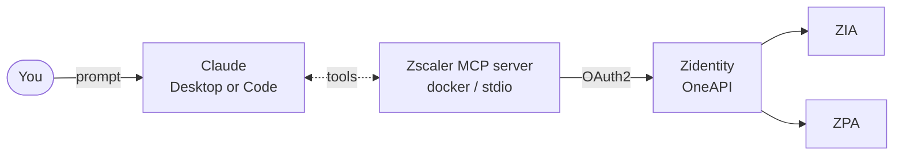

# Zscaler One API and MCP with Claude AI

**Hands-on lab — from credentials to prompts in about 45 minutes.**

> Companion lab for **Zscaler One API + MCP**
> Author: Adonis Li · Lead Technical Instructor

---

## At a glance

| | |
|---|---|
| **Audience** | Enterprise security engineers, DevSecOps, platform admins |
| **Duration** | ~45 minutes (2 core tasks + 1 optional) |
| **Format** | Self-paced, with checkpoint questions |
| **Outcome** | You'll have the Zscaler MCP extension installed in Claude Desktop, then you'll drive real ZIA/ZPA read operations from natural-language prompts. An optional final task walks a guarded write. |

### Learning objectives

By the end of this lab you will be able to:

1. Locate and capture OneAPI credentials from Z Identity.
2. Install and configure the Zscaler MCP Connector in Claude Desktop entirely through the GUI.
3. Verify that Claude can see the Zscaler tools and call them.
4. Use natural-language prompts to inventory, investigate, compare, and report on ZIA/ZPA resources.
5. (Optional) Approve a single low-risk write under HMAC confirmation.

---

## Architecture you're using



The Zscaler extension runs locally inside Claude Desktop. Your credentials stay on your machine, in the OS keychain. Only the extension talks to Zscaler.

---

> ## ⚠️ Safety — please read before you start
>
> - **Use a sandbox, lab, or test tenant.** Do not aim this at a production Zscaler tenant.
> - The extension is **read-only by default** — you must explicitly opt in to writes. Keep that default until the optional write task.
> - Your OneAPI credentials are sensitive. Treat them like any production secret.
> - If your organisation forbids AI tools touching production config, stop here and clear the lab with your security team first.

---

## Setup — Prerequisites (≈10 min)

You need **all** of these before starting Task 1.

| Need | How to check |
|---|---|
| OneAPI enabled on the tenant | Confirmed with the information provided from your lab email. |
| OneAPI credentials issued via Z Identity | Z Identity → Administration → API Key Management → OneAPI Credentials |
| API roles assigned to the credential | E.g., a ZIA role in *ZIA → Administration → Role Management* and a ZPA role in *ZPA → Role Management*. Roles sync to Zidentity → API Resources. |
| Claude Desktop installed (latest version) | Download from claude.ai. macOS or Linux preferred for this lab — see Windows note below. |
| A sandbox / lab Zscaler tenant | Not production. Not a customer environment. zs000abc.zslogin.net for today's lab test.|

### Capture these four values

You will paste them into the extension's configuration GUI in Task 1. Keep them somewhere safe (a password manager is ideal — never a plaintext file in a repo).

```text
ZSCALER_CLIENT_ID       = ...
ZSCALER_CLIENT_SECRET   = ...
ZSCALER_CUSTOMER_ID     = ...
ZSCALER_VANITY_DOMAIN   = ...   (e.g. zs000abc.zslogin.net — your tenant-specific Z Identity domain)
```

> 💡 If any of these are missing, stop and resolve with your Zscaler admin before proceeding. The extension's config will not accept partial credentials.

> ## ⚠️ Windows users — heads up
>
> The Zscaler one-click extension bundles pre-compiled Python packages built for macOS/Linux. On Windows those binaries cannot load, so you'll use a one-time manual config step in Claude Desktop's developer settings instead. The walkthrough is in **Appendix C — Windows manual config**. Everything from Task 2 onwards is identical.

---

## Task 1 — Install the Zscaler extension in Claude Desktop (≈10 min)

**Why this task exists:** Anthropic and Zscaler ship a Zscaler MCP server as a one-click Claude Desktop extension. No Docker, no terminal, no config files — just a few clicks and a credential prompt. This is the recommended path for almost everyone.

### 1.1 Open the Extensions directory

1. Launch Claude Desktop.
2. Open **Settings → Connectors → Customize**.
3. Click **Plus + Icon and Browse Connectors** to open the official directory.
4. Search for **Zscaler** and select the **Zscaler MCP Server** extension.
5. Click **Install**.

Claude Desktop downloads the bundle, unpacks dependencies, and shows the extension's configuration screen. No terminal involved.

### 1.2 Enter your OneAPI credentials

The extension's config screen asks for the four values you captured in setup:

| Field | Value |
|---|---|
| Client ID | `ZSCALER_CLIENT_ID` |
| Client Secret | `ZSCALER_CLIENT_SECRET` |
| Customer ID | `ZSCALER_CUSTOMER_ID` |
| Vanity Domain | `ZSCALER_VANITY_DOMAIN` |

Paste each value in, then click **Save**. Claude Desktop stores these in your **OS keychain** (macOS Keychain / Linux Secret Service) — not in a plaintext config file.

### 1.3 Scope the tools (recommended)

The same configuration screen lets you choose which Zscaler services and toolsets the extension exposes. For this lab, set:

| Setting | Value |
|---|---|
| Services | `zia, zpa` |
| Toolsets | `zia_url_filtering, zpa_app_segments, zia_url_categories` |

Scoping keeps Claude's context lean and reduces the chance of the wrong tool being chosen. You can broaden this later — start narrow.

### 1.4 Verify Claude sees the tools

Start a new conversation in Claude Desktop and ask:

> *"List the Zscaler tools you have access to, grouped by ZIA vs ZPA."*

<span class="ic ic-ok">✓</span> **Check:** Claude lists tool names like `zia_url_filtering_list`, `zpa_application_segment_list`, etc. If Claude says it has no Zscaler tools, the connector or extension didn't activate — close and reopen Claude Desktop, then check **Settings → Connectors** to confirm the Zscaler MCP connector is enabled.

### 🧠 Checkpoint

1. Where are your OneAPI credentials stored after you save them in the extension's GUI? Why does that matter?
2. Why does scoping with **Toolsets** matter, even though all tools default to read-only?

---

## Task 2 — Operations made easy with prompts (≈20 min)

**Why this task exists:** This is the payoff. You're going to run several prompts across three categories — inventory, investigation, comparison/reporting — and watch Claude do work that would otherwise be a lot of portal clicking.

Notice that you are not writing JSON, not paginating, not stitching responses together. Claude does that. Your job is to read the results critically.

### A. Inventory — what do we have?

#### Prompt 1

> *"Using the Zscaler tools, list the first 10 ZPA application segments in our tenant. Show name, segment ID, and domain names. Format as a table."*

Expected: Claude calls `zpa_application_segment_list`, parses the response, and gives you a clean table. The first time you do this in the portal vs here is the first "aha" moment.

#### Prompt 2

> *"How many ZIA URL filtering rules do we have in total? Group the count by action (block / allow / caution), and tell me which rules are currently disabled."*

Expected: A small summary table plus a list of disabled rules. This single prompt replaces opening every rule individually to check state.

#### Prompt 3

> *"List ZIA URL categories whose name contains 'AI', 'social', or 'media'. For each, show the category name, type (predefined vs custom), and approximate URL count."*

Expected: A focused list. Tests Claude's ability to *filter at query time* instead of dumping everything.

### B. Investigation — what's actually happening?

#### Prompt 4

> *"Find any ZIA URL filtering rules that mention 'social' in the rule name or description. For each, tell me which user groups the rule applies to and whether it's currently enabled."*

Expected: A short list with the user-group attribution. This kind of cross-cutting question is exactly what's painful in the portal — multiple clicks per rule to see scoping.

#### Prompt 5

> *"List ZPA application segments whose access policy allows ANY user group. Flag those for review and tell me which ones are enabled in production."*

Expected: A flagged list. Useful as a one-prompt audit you can run periodically.

#### Prompt 6

> *"Summarize the difference between our 'Students' and 'Admin' user-group policies in ZIA. What can one reach that the other can't? Where do they overlap?"*

Expected: A comparison that Claude assembles by inspecting both groups' policy memberships. This is where the AI layer earns its keep — combining tool output into a coherent narrative.

### C. Comparison & reporting — what should we do?

#### Prompt 7

> *"Compare our two largest ZPA application segments by number of domains. Which would be a better candidate to break into smaller segments, and why? Show your reasoning."*

Expected: A recommendation with the supporting numbers. Note: the recommendation is Claude's opinion — your job is to evaluate it, not blindly act on it.

#### Prompt 8

> *"Generate a markdown audit summary of our current ZIA URL filtering policy. Group rules by action, show counts per group, and list any disabled rules. I want to paste this into a change-control ticket."*

Expected: Properly formatted markdown ready for paste. This is where prompt-driven ops starts replacing documentation drudgery, not just clicks.

<span class="ic ic-ok">✓</span> **Check:** All eight prompts returned real data from your tenant. If any returned generic guidance ("here's how you would do this..."), the tool likely wasn't called — re-prompt with *"Please use the Zscaler tools to answer this."* prepended.

### 🧠 Checkpoint

1. For **Prompt 4**, what would the equivalent be in the ZIA portal? Roughly how many clicks did the prompt save you?
2. For **Prompt 7** (compare segments), what would make you trust or distrust Claude's recommendation?
3. Looking at **Prompt 8**, where else in your weekly work could this style of "ask, get formatted output" save real time?

---

## Task 3 (optional) — One guarded write (≈10 min)

> ## ⚠️ Sandbox tenant only
>
> This task creates and then deletes a test resource. Do not run it on a tenant that serves real users. The artifact is namespaced with `LAB-` to be obvious, but you are still making a real config change.

### 3.1 Enable a narrow write tool

Open the Zscaler extension's configuration in **Settings → Extensions → Zscaler MCP Server** and toggle on:

| Setting | Value |
|---|---|
| Enable write tools | ON |
| Write tools allowlist | `zia_url_categories_create, zia_url_categories_delete` |

Save, then close and reopen Claude Desktop so the extension reloads with the new permissions.

### 3.2 Create the test category

> *"Create a new custom ZIA URL category called `LAB-TEST-DELETE-ME` containing exactly one URL: `example.com.au`. Show me what you intend to do and pause for confirmation before applying."*

Claude should:

1. Propose the tool call,
2. Surface the **HMAC confirmation prompt**,
3. Wait for you to approve.

Approve only after reading the proposed payload.

### 3.3 Verify and clean up

> *"List custom ZIA URL categories and find `LAB-TEST-DELETE-ME`. Confirm it exists and show its contents."*

Then:

> *"Delete the custom URL category `LAB-TEST-DELETE-ME`. Confirm before deleting."*

Approve, then re-run the list prompt — the category should be gone.

<span class="ic ic-ok">✓</span> **Check:** You went through two HMAC confirmations (create + delete). The category existed between them and is gone after.

### 🧠 Checkpoint

1. What did the HMAC confirmation actually show you, and why is that the most important security control in this whole pipeline?
2. If a teammate's prompt produced an unexpected write proposal, what's the right action?

---

## Wrap-up

### Reflection (5 min — good for instructor-led discussion)

1. Where would prompt-driven Zscaler ops save you the most time *this week*?
2. What's one task you would **not** want to automate this way, and why?
3. What organisational guardrails (which write tools to allowlist, who can approve HMAC, audit log review cadence) would you want before letting teammates use this against production?
4. If Claude gave you a confidently wrong answer about your tenant, how would you catch it?

### What you can do tomorrow

- Keep the read-only Zscaler extension installed. Use it for inventory and investigation questions you'd otherwise click through the portals.
- Build a small write allowlist for one specific recurring task (e.g., adding a single URL to a known category). Keep the allowlist narrow.
- Treat Claude's output as a *draft change request*, not a fait accompli — review the proposed payload every time.

### Resources

- Zscaler MCP server: `github.com/zscaler/zscaler-mcp-server`
- Claude Desktop extensions directory: Settings → Connectors → Browse Connectors
- Z Identity OneAPI: Administration → API Key Management → OneAPI Credentials
- Model Context Protocol spec: `modelcontextprotocol.io`

---

## Appendix A — Troubleshooting

| Symptom | Likely cause | Fix |
|---|---|---|
| Extension installs but Claude says "no Zscaler tools" | Claude Desktop not fully restarted, or extension disabled | Quit and reopen Claude Desktop entirely; check Settings → Extensions to confirm Zscaler is enabled |
| Extension config rejects credentials | Wrong values, or OneAPI not enabled on the tenant | Re-check the four values in Zidentity; confirm with the Zscaler account team |
| Tools listed but calls return `403` | Credential lacks the required API role | Create / sync an API role in the relevant product, link to the OneAPI credential in Zidentity |
| Tools listed but specific products missing | Tenant lacks the licence, or the service wasn't selected during setup | Check entitlement; reopen the extension config and verify Services includes the product |
| Write prompt runs but no HMAC confirm appears | Write tool not in the allowlist, or write toggle is off | Reopen extension config, confirm "Enable write tools" is ON and the tool name is in the allowlist |
| HMAC confirm shows wrong payload | Claude misread your prompt | **Reject the confirmation.** Re-prompt with explicit constraints. Never approve a payload you didn't intend. |

---

## Appendix B — Checkpoint answer hints

**Task 1**
1. In your **OS keychain** (macOS Keychain Access / Linux Secret Service / Windows Credential Manager when using manual config). The extension never stores them in a plaintext file. This means they're encrypted at rest by the OS and protected by your user account.
2. The Zscaler MCP server exposes a few hundred tools across services. Without scoping, Claude has to reason over all of them, which slows tool selection and increases the chance of picking the wrong one. Scoping is a *performance* and a *safety* improvement, separate from read/write.

**Task 2**
1. ZIA portal: per rule, navigate to Policy → URL Filtering, open each rule, inspect criteria, note groups. Realistically 4–8 clicks per rule plus reading time.
2. Trust improves when Claude shows its work (which tools it called, what it filtered on, the numbers it used). Distrust grows when Claude generalises ("typically these segments..."), summarises without specifics, or gives advice that doesn't reference your actual data.
3. Common candidates: weekly change reports, audit summaries before a compliance review, onboarding documentation for new admins, "what changed since last week" diffs.

**Task 3**
1. The HMAC confirmation shows the exact proposed payload — tool name, target object, fields being set. It is the last human checkpoint before a change goes live, and the one place where the human's accountability binds the AI's intent.
2. Reject the confirmation. Then look at the prompt that produced it — usually the intent was ambiguous. Rewrite the prompt with explicit constraints (target IDs, scope, "do not modify anything outside X") and try again.

---

## Appendix C — Windows manual configuration

If you're on Windows, install the extension via manual configuration instead of the one-click directory install:

1. Open Claude Desktop → **Settings → Developer → Edit Config**. This opens `claude_desktop_config.json` in your default editor (Claude Desktop creates the file if it doesn't exist).
2. Add the following block (merge with any existing `mcpServers` entries):

```json
{
  "mcpServers": {
    "zscaler-mcp-server": {
      "command": "uvx",
      "args": ["--env-file", "C:\\path\\to\\your\\.env", "zscaler-mcp"]
    }
  }
}
```

3. Create the referenced `.env` file with the four `ZSCALER_*` values from setup.
4. Install `uv` if needed: see the Astral docs at `astral.sh/uv`.
5. Save the config file, fully **quit and reopen** Claude Desktop.
6. Resume the lab at **Task 1.4 — Verify Claude sees the tools**.

For the optional write task on Windows, add `"--enable-write-tools", "--write-tools", "zia_url_categories_create,zia_url_categories_delete"` to the `args` array, then restart Claude Desktop.

---

*© 2026 — Lab material for educational use - Adonis Li.*
